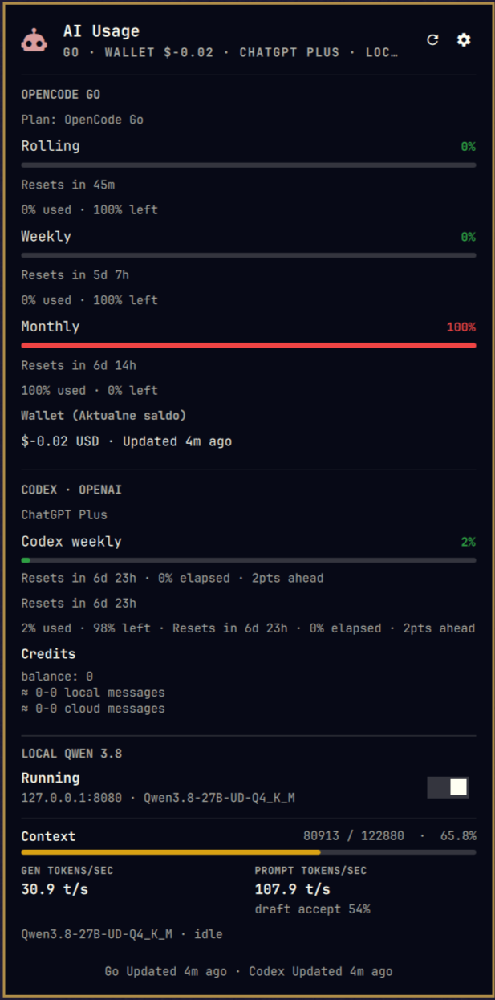

# AI Usage — Omarchy bar widget



Omarchy (Quickshell) bar widget that shows AI provider usage in one panel:

- **OpenCode Go** — rolling / weekly / monthly windows (direct JSON endpoint or `ai-usagebar` fallback)
- **Codex / OpenAI (ChatGPT Plus)** — 5h session + 7d weekly windows side by side, reset countdowns, credits block.
  Data comes from `ai-usagebar usage --json` (Codex OAuth). When the usage endpoint does not report a
  window (e.g. during limit rollbacks/rollouts) the panel says so explicitly instead of guessing.
- **Wallet (Aktualne saldo)** — Opencode Zen credit balance fetched headlessly from the billing page via
  a *dedicated* Chromium profile (never your default browser profile). One-time `--login` required.
- **Local model (llama.cpp)** — running/stopped state with a start/stop toggle, live tokens/sec
  (gen/prompt/3s window), context-window usage, and EAGLE draft-accept rate from the llama.cpp server.

## Features

- Bar: `󰚩  Go 42% · Cdx5h 12% · Qwen 41.2 t/s` (values can be hidden, icon-only mode).
- Red alarm state when any provider window ≥ 90% or a fetch fails.
- Panel: per-window bars with severity colors, resets-in countdowns, % used / left, credits block,
  wallet balance with cache state, Qwen live stats grid.
- Mouse: left click opens the panel, middle click toggles the local model, wheel forces a refresh,
  right click opens the `ai-usagebar` TUI.
- Panel keys: `R` refresh, `S` settings.
- Settings are editable in the panel (API key, endpoint, workspace ID, wallet TTL, unit, host,
  refresh interval, bar values) and persisted to `shell.json` (user-readable only).

## Requirements

- [Omarchy](https://omarchy.ai) (or Quickshell) with bar widgets.
- [ai-usagebar](https://github.com/akitaonrails/ai-usagebar) — for the Codex/OpenAI entry
  (`codex login` must be done once for OAuth).
- `systemctl --user` and a llama.cpp server unit (default `llama-cpp-server.service`) for the local
  model section.
- `chromium` for the wallet fetch (dedicated profile under `~/.config/opencode-balance/`).

## Install

```sh
omarchy plugin clone gotar/omarchy-ai-usage
```

or copy the directory into `~/.config/omarchy/plugins/gotar.ai-usage/`, then enable the **AI Usage**
bar widget from the Omarchy bar configuration (section: right, by default).

## First run

1. Optional: paste your Opencode Go API key in the widget settings (panel → Settings). Leave blank
   to fall back to the `opencode-go` entry configured in `~/.config/ai-usagebar/config.toml`.
2. Wallet: run `scripts/opencode-balance.sh --login` once, sign in to opencode.ai in the dedicated
   Chromium window, and set the workspace ID in the widget settings.
3. Local model: point `localUnit` at your llama.cpp systemd user unit and `localHost` at the server
   (default `127.0.0.1:8080`).

## Files

| File | Purpose |
| --- | --- |
| `manifest.json` | Plugin manifest (bar widget entry point, settings schema) |
| `BarWidget.qml` | Bar button (text, tooltip, alarms, mouse actions) |
| `Panel.qml` | Panel UI + data collection (ai-usagebar JSON, Go endpoint, wallet, systemd, llama.cpp stats) |
| `scripts/opencode-balance.sh` | Wallet balance via dedicated headless Chromium profile (CDP/`--dump-dom`), TTL cache |
| `scripts/qwen-stats.sh` | One-line JSON with llama.cpp live stats (tokens/sec, ctx, draft accept) |

## IPC

| Command | Effect |
| --- | --- |
| `refresh` | Force a full refresh cycle |
| `localStart` / `localStop` / `localToggle` | Manage the local model unit |

## License

MIT
